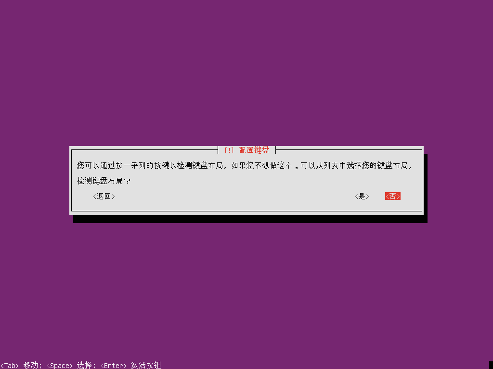
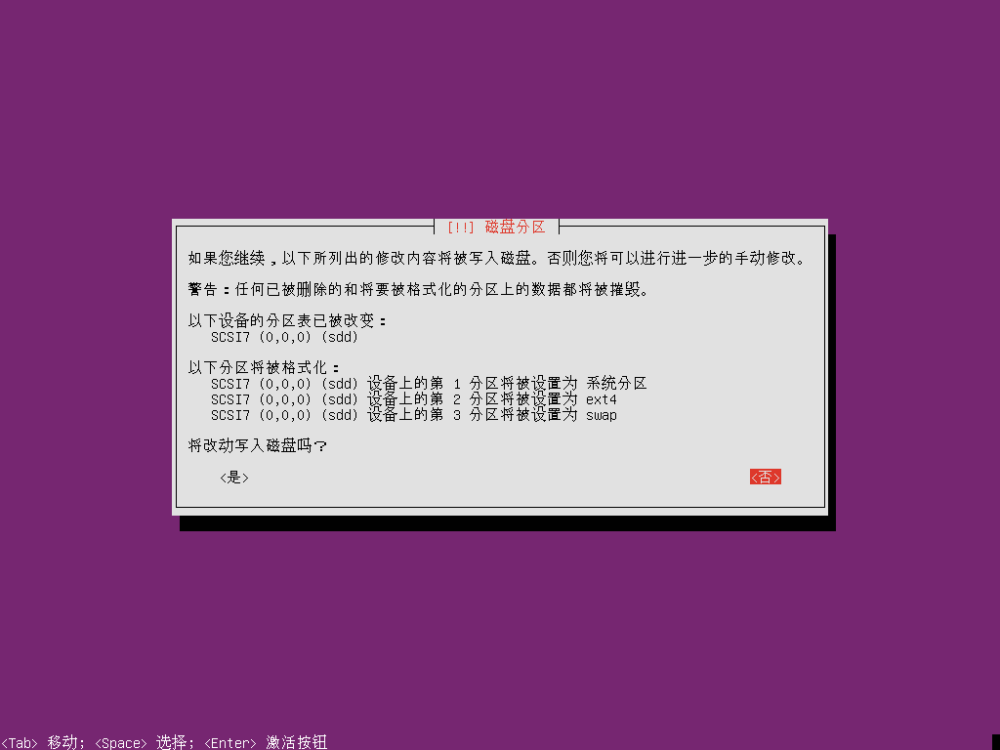

# 安装操作系统

前面已经使用 `Etcher` 制作的系统安装 U盘，现在把它查到即将构建 NAS 的计算机上引导启动吧。

## 系统盘的选择

本指南将 Ubuntu Sever 操作系统安装到一个大于 16GB 的 U 盘上，当然，如果你条件允许，也可以将操作系统安装到独立的 SSD 或 HDD 硬盘上。

> **特别注意**：不要将操作系统安装到用于存储数据的硬盘上，我们提倡系统与数据分离。

## 引导系统启动

把制作好的 U 盘系统盘和另外一个要安装系统的 U 盘都插到要构建 NAS 的主机上。如果开机时没有自动引导到下图所示的安装界面，你可能需要重启计算机并在看到 BIOS 启动界面的同时按下启动设备列表的快捷键，通常是 `F7 ~ F12` 中的一个，具体参阅电脑或主机板的说明书。

### 第一步 安装菜单

选择 `Install Ubuntu Server`

### 第二步 选择安装语言

可以选择`简体中文`

如果选择了中文，则会有语言不完整的提示。

### 第三步 选择区域

### 第四步 配置键盘

中国使用的就是标准英制键盘，因此无需检查，直接跳过即可。

选择键盘所属国家

指定键盘布局

### 第五步 配置网络

系统安装器会自动配置网络，并通过 `dhcp` 获得局域网 IP 地址。

设置主机名，可以指定一个自己喜欢的名字，本指南将使用 `GetNAS` 作为主机名。

### 第六步 设置用户名和密码

你可以随意设置用户名和密码，本指南将使用 `GetNAS` 作为全名，`getnas` 作为用户名。

如果你设置的密码为简单的纯字母或纯数字，会收到弱密码提示。

根据需要选择是否加密用户 `getnas` 的主目录，即 `/home/getnas/`。

### 第七步 设置时钟

因为我们的构建 NAS 的计算机已接入了互联网，安装程序会自动探测我们所在的时区，通常都能正确的识别，如果无法识别请手动设置。

这里要选择`是`，确认时区。

### 第八步 磁盘分区

如果你计划用作安装系统的那个 16GB 以上的 U 盘是 FAT32 格式的，在这一步可能会看到卸载提示。这是因为 Ubuntu 系统安装器会自动的挂在这种分区。

这里要选择`是`，确认卸载。

`UEFI` 安装确认，如果你的主板支持并开启了 `UEFI` 引导功能，那么就很可能看到下图提示，这里选择`是`确认即可。

在分区想到中选择`向导-使用整个磁盘`，系统安装器会自动的对目标安装介质进行恰当的分区。

选择将要用作系统安装的目标介质，如下图。列表中有 4 块 20GB 的磁盘将用作数据存储，另外有一个 16GB 的 U 盘用作系统安装，选择它按`回车`键确认。

分区确认，下图所示为系统安装器对 16GB U盘创建的分区信息，选择`是`，将分区信息写入磁盘。

接下来安装器会自动执行系统安装相关的任务。

